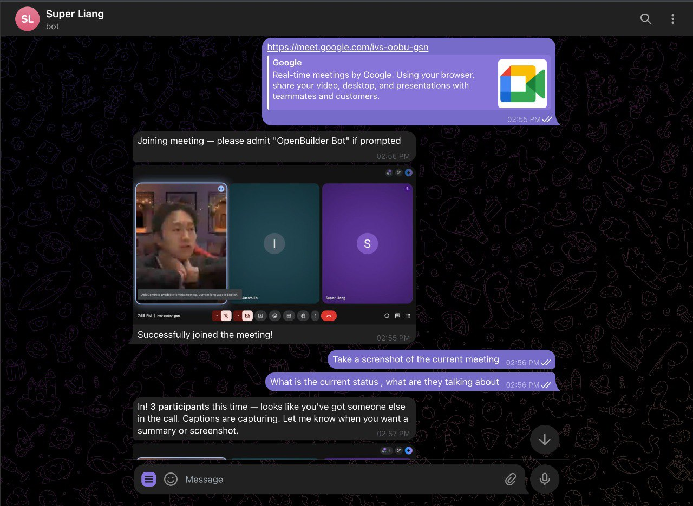
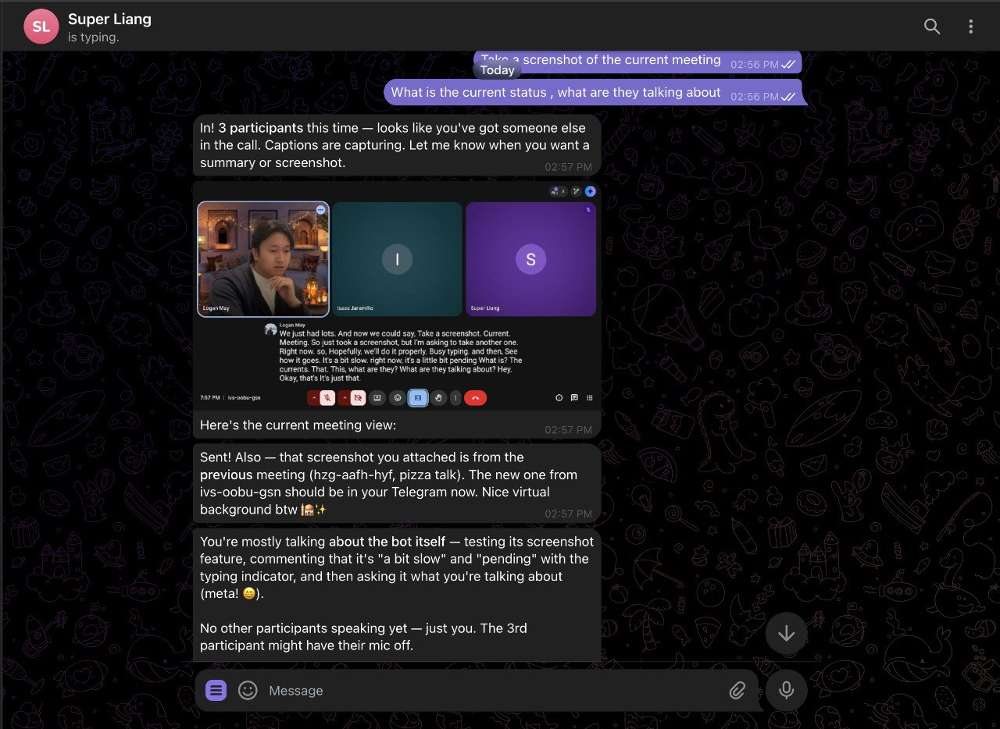

# OpenBuilder

**Open-source AI meeting assistant** — a Read AI alternative that joins your Google Meet meetings, captures live transcripts, and generates AI-powered meeting reports.

Get meeting summaries, action items, key decisions, and speaker analytics — all from your terminal.

<p align="center">
  
  
</p>

## Features

- **Audio Capture + Whisper** — Captures browser audio via PulseAudio virtual sink, transcribes with OpenAI Whisper (no captions needed)
- **Caption Scraping Fallback** — DOM-based caption capture for systems without PulseAudio/ffmpeg
- **Google Meet Bot** — Headless Chromium bot joins meetings automatically
- **AI Meeting Reports** — Post-meeting analysis with summaries, chapters, action items, decisions, and questions
- **Speaker Analytics** — Talk time, word count, and participation percentages per speaker
- **Multiple AI Providers** — Claude (Anthropic) and OpenAI supported; bring your own API key
- **Standalone Analysis** — Run `summarize` or `report` on any transcript file, not just live meetings
- **OpenClaw Skill** — Integrates as a skill for OpenClaw agents
- **Privacy-First** — Your data stays local; AI processing only happens with your own API keys

## Quick Start

### 1. Install

```bash
npx openbuilder
```

This installs the OpenClaw skill and Chromium browser.

### 2. Configure AI (Optional but Recommended)

```bash
# Set your AI provider API key for meeting reports
npx openbuilder config set anthropicApiKey sk-ant-your-key-here
# Or use OpenAI instead
npx openbuilder config set openaiApiKey sk-your-key-here
npx openbuilder config set aiProvider openai
```

Or use environment variables:

```bash
export ANTHROPIC_API_KEY=sk-ant-your-key-here
# or
export OPENAI_API_KEY=sk-your-key-here
```

### 3. Join a Meeting

```bash
# As a guest (host must admit)
npx openbuilder join https://meet.google.com/abc-defg-hij --anon --bot-name "Meeting Bot"

# With Google authentication (no admission needed)
npx openbuilder auth  # one-time setup
npx openbuilder join https://meet.google.com/abc-defg-hij --auth
```

### 4. Get Results

```bash
# View transcript
npx openbuilder transcript

# Quick AI summary
npx openbuilder summarize

# Full meeting report (summary + action items + decisions + analytics)
npx openbuilder report
```

## Commands

| Command | Description |
|---------|-------------|
| `openbuilder` / `openbuilder install` | Install skill + Chromium |
| `openbuilder join <url> [options]` | Join a Google Meet meeting |
| `openbuilder auth` | Save Google session for authenticated joins |
| `openbuilder transcript [--last N]` | Print the latest transcript |
| `openbuilder screenshot` | Take an on-demand screenshot |
| `openbuilder summarize [path]` | AI summary of a transcript |
| `openbuilder report [path]` | Full AI meeting report |
| `openbuilder config [subcommand]` | Manage configuration |
| `openbuilder help` | Show help |

### Join Options

```
--auth          Join using saved Google account
--anon          Join as a guest (requires --bot-name)
--bot-name      Guest display name
--duration      Auto-leave after duration (30m, 1h, etc.)
--audio         Force audio capture mode (PulseAudio + Whisper)
--captions      Force caption scraping mode (DOM-based fallback)
--headed        Show browser window (debugging)
--camera        Join with camera on (default: off)
--mic           Join with microphone on (default: off)
--no-report     Skip auto-report after meeting ends
--verbose       Show real-time transcript output
```

By default, capture mode is `auto`: uses audio capture if PulseAudio, ffmpeg, and `OPENAI_API_KEY` are all available. Otherwise falls back to caption scraping.

## AI Meeting Reports

When a meeting ends (or when you run `openbuilder report`), OpenBuilder generates a structured report:

```markdown
# Meeting Report: abc-defg-hij — 2026-03-12

## Summary
The team discussed the Q1 roadmap, focusing on three main initiatives...

## Chapters
1. [14:30] Sprint Planning — Review of current sprint velocity
2. [14:42] Q1 Roadmap — Discussion of three main initiatives
3. [14:55] Resource Allocation — Team capacity and hiring plans

## Action Items
- [ ] Draft Q1 roadmap document (@Alice)
- [ ] Schedule design review for new dashboard (@Bob)
- [ ] Research caching solutions and present options (@Carol)

## Key Decisions
- Decided to prioritize the dashboard redesign over the API refactor
- Agreed to move to bi-weekly sprints starting next month

## Key Questions
- Should we invest in automated testing infrastructure? (unanswered)
- When is the design system migration complete? (answered)

## Speaker Analytics
| Speaker | Talk Time | % of Meeting | Words |
|---------|-----------|--------------|-------|
| Alice   | 12:30     | 45%          | 1,850 |
| Bob     | 8:15      | 30%          | 1,200 |
| Carol   | 6:45      | 25%          | 980   |

## Metadata
- Duration: 27:30
- Participants: 3
```

## Configuration

### Config File

Settings are stored in `~/.openbuilder/config.json`.

```bash
# View all settings
npx openbuilder config

# Set values
npx openbuilder config set aiProvider claude
npx openbuilder config set anthropicApiKey sk-ant-...
npx openbuilder config set openaiApiKey sk-...
npx openbuilder config set botName "My Meeting Bot"
npx openbuilder config set defaultDuration 60m
npx openbuilder config set captureMode audio
npx openbuilder config set whisperModel whisper-1

# Get a value
npx openbuilder config get aiProvider

# Delete a value
npx openbuilder config delete defaultDuration
```

### Environment Variables

Environment variables override config file values:

| Variable | Config Key | Description |
|----------|-----------|-------------|
| `OPENBUILDER_AI_PROVIDER` | `aiProvider` | `claude` or `openai` |
| `ANTHROPIC_API_KEY` | `anthropicApiKey` | Anthropic API key |
| `OPENAI_API_KEY` | `openaiApiKey` | OpenAI API key (also used for Whisper) |
| `OPENBUILDER_BOT_NAME` | `botName` | Default bot name |
| `OPENBUILDER_DEFAULT_DURATION` | `defaultDuration` | Default meeting duration |
| `OPENBUILDER_CAPTURE_MODE` | `captureMode` | `audio`, `captions`, or `auto` (default) |
| `OPENBUILDER_WHISPER_MODEL` | `whisperModel` | Whisper model name (default `whisper-1`) |

## Authentication

The bot can join meetings in two modes:

### Guest Mode (default)
```bash
npx openbuilder join <url> --anon --bot-name "Meeting Bot"
```
The bot joins as a guest. The meeting host must admit the bot.

### Authenticated Mode
```bash
# One-time setup: sign into Google in a browser window
npx openbuilder auth

# Join as your Google account (no host admission needed)
npx openbuilder join <url> --auth
```

The auth command opens a headed Chromium browser. Sign into your Google account, then press Enter. The session is saved to `~/.openbuilder/auth.json` and reused for future joins. Re-run if the session expires.

### Automated Auth (Headless Servers)

For headless servers or automated bots, use `--auto` mode with credentials in `.env`:

```bash
echo "GOOGLE_EMAIL=you@gmail.com" >> .env
echo "GOOGLE_PASSWORD=yourpassword" >> .env
npx openbuilder auth --auto
```

This signs in non-interactively and saves the session to `~/.openbuilder/auth.json`.

## Standalone Transcript Analysis

OpenBuilder's AI analysis works on any transcript file in `[HH:MM:SS] Speaker: text` format — not just from live meetings:

```bash
# Summarize any transcript
npx openbuilder summarize ~/meetings/standup-2026-03-12.txt

# Full report on any transcript
npx openbuilder report ~/meetings/standup-2026-03-12.txt
```

## File Locations

| Path | Description |
|------|-------------|
| `~/.openbuilder/config.json` | Configuration file |
| `~/.openbuilder/auth.json` | Saved Google session |
| `~/.openbuilder/auth-meta.json` | Auth metadata (email, timestamp) |
| `~/.openbuilder/builder.pid` | Running bot PID |
| `~/.openclaw/workspace/openbuilder/transcripts/` | Live caption transcripts |
| `~/.openclaw/workspace/openbuilder/reports/` | AI meeting reports |

## How It Works

1. **Join**: Launches headless Chromium with stealth patches (navigator.webdriver, WebGL, plugins), navigates to the Meet URL, enters the bot name, disables camera/mic, and clicks join.

2. **Transcript Capture** (two modes):
   - **Audio mode** (default when available): Creates a PulseAudio virtual sink, routes all browser audio to it, captures audio with ffmpeg into 30-second WAV chunks, and transcribes each chunk with OpenAI Whisper. No captions needed — works like Read AI / Granola.
   - **Caption mode** (fallback): Enables Google Meet's built-in live captions, then injects a MutationObserver that watches for caption DOM mutations. Speaker names are extracted from badge elements. Captions are deduplicated and written to disk with timestamps.

3. **AI Analysis**: When the meeting ends, the transcript is sent to Claude or OpenAI with carefully designed prompts. Long transcripts are chunked and merged. The AI extracts summaries, chapters, action items (with assignee detection), key decisions, and key questions.

4. **Speaker Analytics**: Talk time is estimated from transcript timestamps and speaking rate heuristics. Per-speaker word counts and participation percentages are calculated.

## Requirements

- **Node.js** >= 18
- **playwright-core** (installed automatically)
- **Optional**: `@anthropic-ai/sdk` or `openai` npm package for AI features
  ```bash
  npm install @anthropic-ai/sdk  # For Claude
  npm install openai              # For OpenAI (also required for audio capture mode)
  ```

### Audio Capture Mode (recommended)

For audio capture via PulseAudio + Whisper, you also need:

- **PulseAudio** — `apt install pulseaudio` (most Linux desktops have this already)
- **ffmpeg** — `apt install ffmpeg`
- **OpenAI API key** — for Whisper transcription (`OPENAI_API_KEY` env var or config)

If these aren't available, OpenBuilder automatically falls back to caption scraping.

## OpenClaw Bot Setup

To set up OpenBuilder as an automated meeting bot (e.g. for OpenClaw agents):

1. **Install**: Clone the repo or `npm install openbuilder`
2. **Configure credentials** in `.env`:
   ```bash
   GOOGLE_EMAIL=you@gmail.com
   GOOGLE_PASSWORD=yourpassword
   # For AI reports:
   ANTHROPIC_API_KEY=sk-ant-...
   # Or: OPENAI_API_KEY=sk-...
   ```
3. **Save Google session**: `npx openbuilder auth --auto`
4. **Join meetings**: `npx openbuilder join <url> --auth --captions`
5. **Transcripts** saved to `~/.openclaw/workspace/openbuilder/transcripts/`
6. **Reports** saved to `~/.openclaw/workspace/openbuilder/reports/`

### Notes

- `.env` is gitignored — safe for credentials
- Auth session saved to `~/.openbuilder/auth.json` — re-run `auth --auto` if expired
- Caption mode (`--captions`) is the most reliable on headless servers
- Audio mode (`--audio`) requires PulseAudio + ffmpeg + OpenAI key + Xvfb (experimental on servers)

## Platform Compatibility

OpenBuilder works anywhere OpenClaw runs, as long as Playwright Chromium is available.

| Platform | Status | Notes |
|----------|--------|-------|
| **macOS** (Mac Mini, MacBook — Intel & Apple Silicon) | ✅ Tested | Chromium installs automatically. Captions mode works great. No PulseAudio needed. |
| **Linux x64** (Ubuntu, Debian, VPS, EC2) | ✅ Tested | May need system deps: `npx playwright-core install-deps chromium`. Headless servers need Xvfb. |
| **Windows** (via WSL2) | ✅ Should work | Same as Linux x64. Not yet tested — feedback welcome. |
| **Docker / Podman** | ✅ Should work | Run `npx playwright-core install-deps chromium` in container. Not yet tested. |
| **Raspberry Pi** (ARM64, Pi 4/5) | ⚠️ Not tested | Playwright Chromium ARM builds can be unreliable. May need manual Chromium install. |
| **Raspberry Pi 3** (ARMv7) | ❌ Not supported | Playwright does not ship ARMv7 Chromium. |

### macOS (Mac Mini, MacBook)

- `npx openbuilder` installs Chromium automatically
- Audio capture mode is not available (no PulseAudio) — captions mode is the default and works great
- Auth: `npx openbuilder auth` opens a browser window — sign in and press Enter
- For headless/unattended operation: use `--auto` auth with `.env` credentials

### Linux (Ubuntu, Debian, VPS, EC2)

- Install system dependencies: `npx playwright-core install-deps chromium`
- For headless servers (no display): start Xvfb first — `Xvfb :99 -screen 0 1280x720x24 &` and `export DISPLAY=:99`
- Audio capture mode available if PulseAudio + ffmpeg are installed (optional — captions mode works without them)

### VPS Providers

Works on any VPS that runs OpenClaw:

- **AWS** (EC2, Lightsail) — tested ✅
- **Oracle Cloud** (Always Free tier) — should work
- **Hetzner**, **Fly.io**, **GCP**, **Railway**, **Render** — should work (Linux x64)
- **DigitalOcean** — should work

Minimum: 1 vCPU, 1GB RAM (Chromium is the main resource consumer).

### Requirements

1. **Node.js 18+**
2. **OpenClaw** running on the machine
3. **A Google account** for the bot (or join as guest with `--anon`)
4. **An AI API key** — Claude (Anthropic) or OpenAI — for meeting reports (optional but recommended)

### Quick Setup (any platform)

```bash
npx openbuilder                           # Install skill + Chromium
npx openbuilder auth                      # Sign into Google (one-time)
npx openbuilder config set anthropicApiKey sk-ant-...  # For AI reports
```

Then tell your OpenClaw agent: "Join this meeting: https://meet.google.com/..."

### Known Limitations

- **Google Meet only** — Zoom and Teams support planned for a future release
- **Captions depend on Google Meet's CC feature** — if Meet changes their DOM structure, caption scraping may break
- **Audio capture mode is experimental** on headless servers — PulseAudio routing can be unreliable. Use `--captions` for reliability
- **Bot appears as a participant** — other meeting participants will see "Super Liang" (or your bot's Google account name) in the People panel
- **Google may block automated logins** — if Google flags the bot account, re-run `npx openbuilder auth` interactively or from a different IP
- **One meeting at a time** per bot instance

## OpenClaw Integration

OpenBuilder ships as an OpenClaw skill. After running `npx openbuilder`, it's available to your OpenClaw agent. The agent can:

- Join meetings on your behalf
- Capture and summarize transcripts
- Generate full meeting reports with action items and decisions
- Send screenshots to your chat on demand
- Tell you what's being discussed in real time

See [SKILL.md](./SKILL.md) for the full agent integration guide.

## License

MIT
